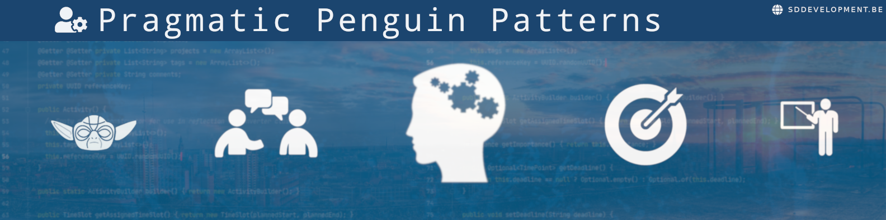

#  :clipboard: Penguin Pragmatic Patterns

<!-- ALL-CONTRIBUTORS-BADGE:START - Do not remove or modify this section -->

<!-- ALL-CONTRIBUTORS-BADGE:END -->

A learning and development repository, aimed to share knowledge with other technical professionals.
The [docs](./docs) section of this repository is somewhat of a "personal wiki". It contains knowledge and
information that has been collected from various sources, and is extended with some personal interpretations and experiences of the author.  

**Table of Contents:**

<!-- vim-markdown-toc GitLab -->

* [Goal, Philosophy and outline](#goal-philosophy-and-outline)
* [Repository Structure](#repository-structure)
  * [Noteworthy sections and files](#noteworthy-sections-and-files)
* [Tech Stack](#tech-stack)
* [Contributors ✨](#contributors-)

<!-- vim-markdown-toc -->

----

## Goal, Philosophy and outline

A lot of knowledge is available on the internet, in various talks, and in books.
But finding your way in this vast ocean of knowledge can be a challenge.
In order to assist fellow learners, we have started to collect our personal experiences in this repository.

The initiative was started by [@stijn-dejongh](https://github.com/stijn-Dejongh), who is a self-improvement enthousiast, and an avid software developer.
In order to avoid confusing terminology and avoid having to explain the definition of certain words multiple times, please take a look at the [Glossary](./docs/0\ Glossary).

## Repository Structure

Most of the techniques, tactics, and behavioural patterns collected will fit some sort of category, which is usually outlined by the title of the directory in which the content is stored.
Some general purpose information will be stored at the top level.

### Noteworthy sections and files
| Item | Location | Description |
|---|---|---|
| Glossary | [`./docs/GLOSSARY.md`]('./docs/0\ Glossary') | A list of Terminology, acronyms and definitions that are used throughout the different files and knowledge resources. This can be used as a dictionary, or as a reference guide.
| Changelog | [`./CHANGELOG.md`](./CHANGELOG.md) | Keeping track of your changes is hard work, documenting after the facts even more so. This file aims to allow small granular updates to help with this effort. |

## Tech Stack

| Library | Usage |
|---|---|
| [SDDevelopment DocGen v2.0.0](https://github.com/sddevelopment-be/document-generation) | Converting the markdown documents into various document formats |
| [adrianvlupu/C4-Builder](https://adrianvlupu.github.io/C4-Builder) | Node.js based documentation parser, adding C4 and PlantUML support to [Docsify](https://docsify.js.org/#/) |
| [PlantUML](https://plantuml.com/) | Diagrams as text |

## Contributors ✨

If you wish to contribute in any way to this initiative, please take a look at our [Contribution Guide](./CONTRIBUTING.md).
Thanks goes to these wonderful people ([emoji key](https://allcontributors.org/docs/en/emoji-key)):

<!-- ALL-CONTRIBUTORS-LIST:START - Do not remove or modify this section -->
<!-- prettier-ignore-start -->
<!-- markdownlint-disable -->
<table>
  <tr>
    <td align="center"><a href="http://sddevelopment.be/"> <b>Stijn Dejongh</b></a> <a href="#tool-stijn-dejongh" title="Tools">🔧</a> <a href="https://github.com/sddevelopment-be/penguin-programming/commits?author=stijn-dejongh" title="Documentation">📖</a> <a href="#design-stijn-dejongh" title="Design">🎨</a></td>
    <td align="center"><a href="https://github.com/IreenVL"> <b>Ireen Van Laethem</b></a> <a href="#ideas-IreenVL" title="Ideas, Planning, & Feedback">🤔</a> <a href="https://github.com/sddevelopment-be/penguin-programming/pulls?q=is%3Apr+reviewed-by%3AIreenVL" title="Reviewed Pull Requests">👀</a></td>
    <td align="center"><a href="https://github.com/gustinsi"> <b>gustinsi</b></a> <a href="https://github.com/sddevelopment-be/penguin-programming/pulls?q=is%3Apr+reviewed-by%3Agustinsi" title="Reviewed Pull Requests">👀</a></td>
  </tr>
</table>

<!-- markdownlint-restore -->
<!-- prettier-ignore-end -->

<!-- ALL-CONTRIBUTORS-LIST:END -->

This project follows the [all-contributors](https://github.com/all-contributors/all-contributors) specification. Contributions of any kind welcome!
