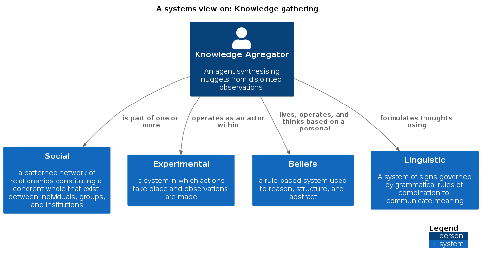
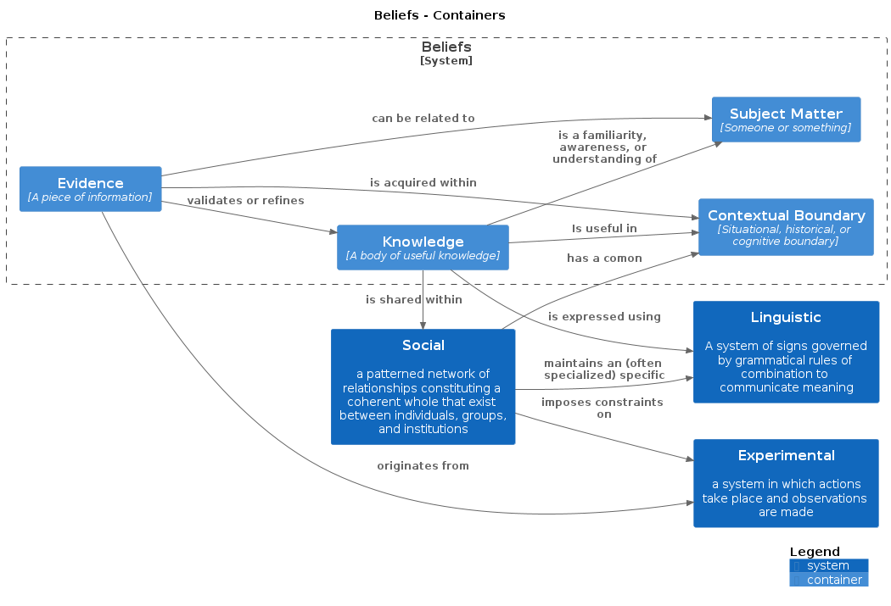
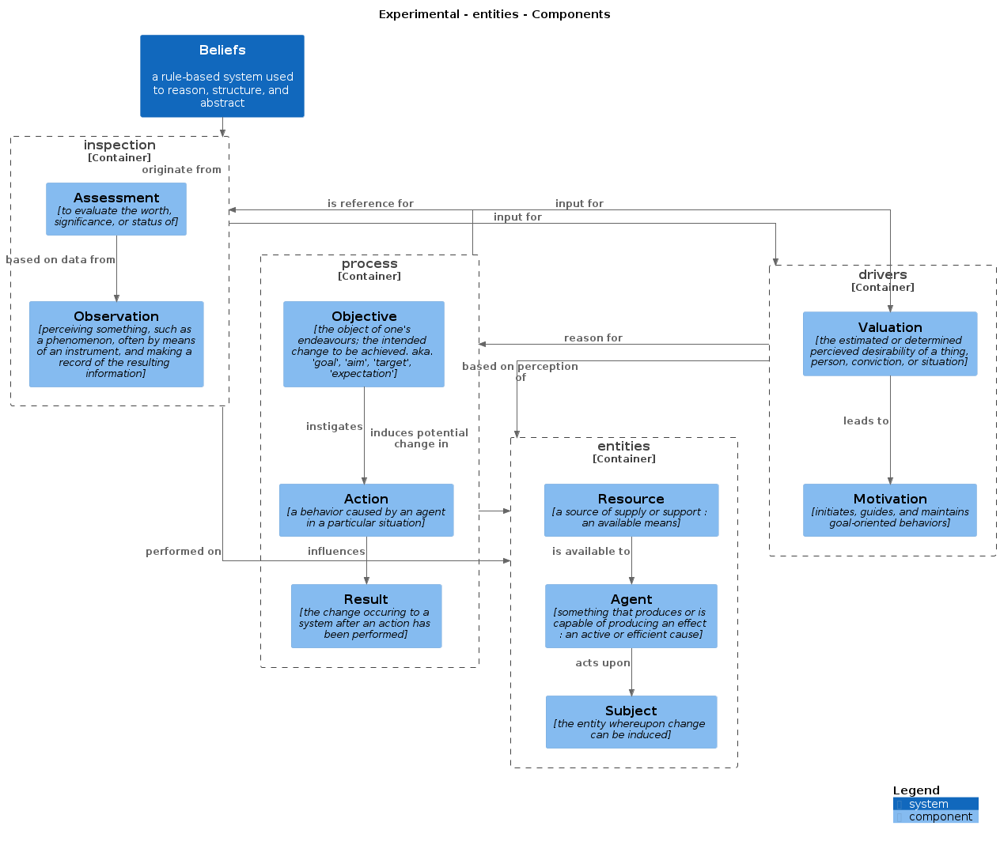
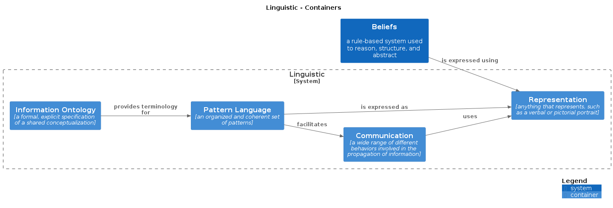

# 0_Pattern_Language

Exchanging knowledge is a challenging activity. The aim is to communicate thoughts and ideas in a way that makes them resonate with the receiving party. To communicate effectively, groups of people tend to resort to using jargon. The term `jargon` is defined as _"The specialized language of a trade, profession, or similar group, especially when viewed as difficult to understand by outsiders."_. Its goal is to make the exchange of information more efficient by giving specific names to things that are highly relevant to the in-group. It is said that the Inuit have over thirty words to differentiate between different types of snow. Other professions, such as software developers, make heavy use of metaphors to refer to technical concepts.

## Structuring what we know

When looking for a structured way to represent ideas, experiences, or cookbooks (i.e. knowledge), it helps to first take a look at what we know of _"knowledge"_ itself. Us software developers tend to resort to modeling things when we want to understand them a bit better. Drawing out our ideas, and how they relate to each other helps us create a "map" of reality.

### What we think we know

### Our experiences shape us

> "I will believe it when I see it!"

### Noise or signal?

> Human beings have the unique ability to name things that do not exist, and reason about them.

When you talk to people, you rely on a shared understanding of the language and terminology you use.

## So, what is a Pattern Language?

## The structure used in this knowledge base

### Patterns

For consistency, the patterns follow a similar structure.
As we all know, **context matters**. This is why each pattern is prefaced with a short description of
when it can be useful to consider using it.

We want to share information about both things you can do, as well as about ideas and models that can change the way you perceive a situation.
In order to achieve this, the patterns in this knowledge base are grouped in:
- Concepts
- Practices

#### Concepts

#### Practices

Practices are a set of actionable recipes, that can help you achieve certain goals.
As with all advice, these are not guaranteed to give results. There is no such thing as a
sure-fire approach that works in any situation. To make these patterns as helpful as possible, they include a short description of the
circumstances in which they usually work well.

> [!WARNING] **This is not a bingo chart.**  
> Unlike Pokemon, you will not get a special prize for implementing all of them in your life.
> You are encouraged to be eclectic, and only use the practices that resonate with you.

## References

| Resource                                                                                                            | Author                                | Description                                                        |
| ------------------------------------------------------------------------------------------------------------------- | ------------------------------------- | ------------------------------------------------------------------ |
| [DSL Catalog](https://www.martinfowler.com/dslCatalog/index.html)                                                   | Martin Fowler                         | Patterns used in the "Domain Specific Languages" book by M. Fowler |
| [A Pattern Language for Pattern Writing](https://www.hillside.net/index.php/a-pattern-language-for-pattern-writing) | Gerard Meszaros, Object Systems Group | A self-describing meta-SPL                                         |
| [Structurizr modeling DSL](https://github.com/structurizr/dsl)                                                      | Structurizr Ltd                       | DSL used to synthesize the context of the problem domain           |
| [Language Workbench](https://www.martinfowler.com/articles/languageWorkbench.html)                                  | Martin Fowler                         | Essay on the use of DSLs and meta-programming systems              |
