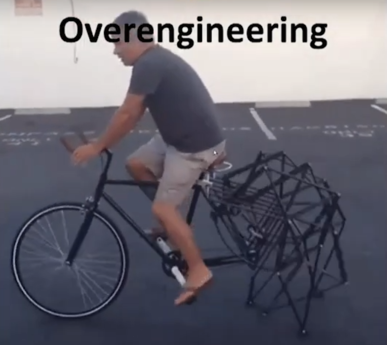

# Good Enough Code

## Applicable Context

**Issue: You get told that you overcomplicate simple tasks.**

A mistake passionate programmers tend to make is to over-design simple things to make them theoretically and aesthetically more beautiful than they need to be at that point in time.
In doing so, they often end up spending much more time and mental effort on a piece of software than is needed (or will ever be valuable).

Writing clean code is admirable, but it also has to make sense for the problem at hand.
Creating a specific design by applying a pattern is to be done when it solves the problem at hand and makes the code more readable, robust, extensible or reusable.

## Description of Pattern

**Ask yourself:** _"Is this code likely to be changed/expanded in the future?""Is my design solving an issue that is here NOW, or am I solving an issue that might never happen?""If this expected issue occurs in the future, can it be fixed easily at that time?"_

The idea of Good Enough Code is to write code as well designed as it needs to be AT THIS POINT IN TIME.
If an idea for a more generic solution comes to mind during your implementation, take note of it.
If in the future the problem you anticipated actually happens, or the code you wrote now is reused, it will be solved at that time.

Make sure the code you write at this point in time adheres to the basic principles of clean code and design, but do not solve future problems that might never happen.

## Key Performance Metrics

- Throughput time of changes
- Regression introduced during tasks
- Function point count of changes
- Cyclomatic complexity
- Readability

## Related Patterns and Resources

| Item | Description | Action |
|---|---|---|
| [Enterprise Quality FizzBuzz](https://github.com/EnterpriseQualityCoding/FizzBuzzEnterpriseEdition)| A prime example of overdesigning something that can be done in a way more simple manner.| Go through the codebase, and ask _"Why would you want to do this? And why is it overkill here?"_ |
| [The bowling game kata](http://www.butunclebob.com/ArticleS.UncleBob.TheBowlingGameKata) | A programming kata by uncle Bob. Appart from learning how he thinks, the excercise also focusses on supressing your personal need to overly beautify a simple project. | Do the excercise and stop yourself from creating too many classes. Repeat the mantra: _"This is fine for now"_ to supress your urges to add indirection or OO concepts to the design. |
