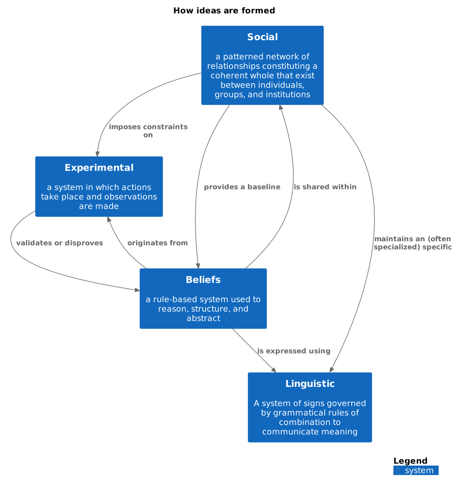

# 1_Learning

In the modern economy, the ability to learn new skills and concepts is a significant competitive advantage. The power of knowledge is
recognized throughout human history. Societies from Ancient Greece to medieval Japan placed a great value on education and invested heavily in
knowledge sharing and skill development.

In Ancient Greece, education was highly valued, and young boys were taught a wide range of subjects.
Their education was comprehensive, covering reading, writing, mathematics, music, and physical education, aiming to produce well-rounded individuals
who could participate in civic life and contribute to society. The philosophers of Athens, such as Socrates and Plato, emphasized critical thinking
and self-examination as vital aspects of education.

Similarly, the Romans viewed the pursuit of knowledge as a noble virtue, focusing on practical skills such as public speaking, accounting, and
military strategy. Education was seen as the primary way to advance socially and politically. Many successful Roman politicians were  
well-educated orators and authors.

> [!QUOTE]
> "Nothing in life is to be feared, it is only to be understood"
> ~ Marie Curie, circa 1951

In ancient Japan, the samurai were well-versed in both reading and writing, and were instructed in a range of subjects in order to instill a sense
of discipline and duty. Similarly to the Greeks and Romans, the pursuit of knowledge and the honing of one's innate skills was seen as a moral duty,
essential for sharpening the minds and character of their citizens and making them valuable assets capable of contributing to society in various
ways. We have all heard how the Japanese samurai were fearless in battle, disciplined in their actions, and above all honorable. But did you
know this warrior class was also well-versed in both reading and writing? Similarly to the greek philosophers, and roman writers, the samurai were
no stranger to the softer sides of life. Some of their pondering has been passed through the ages in the form of traditional haiku.

All of these societies believed that the pursuit of knowledge, and the honing of innate skills were moral duties that sharpened minds and character
and contributed to society. Although their military prowess is well known, all these societies had advanced artistic, scientific, and social ideas.
Modern education finds its roots in these ancient traditions, and concepts like the Socratic method, democracy, stoicism, the Hippocratic Oath, and
citizenship continue to influence our society, attitudes, and beliefs profoundly.
The pen has proven to be more powerful than the sword, indeed.

> [!QUOTE]
> "I know no safe depository of the ultimate powers of society but the people themselves; and if we think them not enlightened enough to exercise
> their control with a wholesome discretion, the remedy is not to take it from them, but to inform their discretion by education."
> - Thomas Jefferson

As we move forward, we must remember the critical role that education has played -- and will continue to play -- in human development.
In the upcoming chapter, we will explore a powerful mental model that will transform the way you approach knowledge and enhance your reasoning
and learning skills. See you there!

## What is knowledge?

Before we dive into the specifics of learning concepts and practices, we must define what exactly we mean when we speak about "knowledge."
Understanding the concept of knowledge will provide us with a clear mental map to guide us on our learning journey.
As the saying goes, _"When you learn a new language, you gain a new soul"_. With this in mind, let's aim to make curiosity a part of our mental DNA.
This way, gathering knowledge and growing as a person will feel just as natural to us as breathing air does.

In this section, we will outline what knowledge looks like and how it ties in with all aspects of our lives, including the culture we live in, the
people we know, and the actions we take. It is important to reflect on which ideas resonate with you and which do not.
You are encouraged to take the information that is useful to you, and to leave the rest behind. **Do what feels right for you!**
After all: this is your journey. Who are we to tell you how to live your life?

### How our ideas are formed

The beliefs we hold are little more than a reflection of the experiences we encountered on our path, and our ability to reason about them.
In the simplest terms: we try something, and learn from the result. As a child, some might have had the unpleasant experience of touching a hot stove. 
Through trial and error, we have gained the belief that things that are glowing red are extremely hot.
This helped us to avoid putting our hand on a hot stove.

Apart from learning from our own mistakes, we learn from others. In the example of the child placing its hand on a glowing stove, the unpleasant 
situation could have been avoided if a guardian had stepped in. They would warn the child of the dangers of touching hot objects.
And in doing so, sharing their own knowledge with the infant. Our social circle influences our beliefs substantially.
As the saying goes, "We become who we surround ourselves with".

If we want to become effective learners, this means we should have a theory on what learning is to us, aim to work in a safe and supportive social 
and physical environment, discover our own rules and assumptions, reconnect with reality-information from the environment, and reorganize ourselves by changing our
rules/assumptions.
This is a fancy way of saying: find a way to get comfortable, and take a good hard look at yourself and the world.
From there you will explore new ideas, and try to apply them to your life as you see fit. Donald B. Maudsley described this as the idea of
_"Meta learning"_ in 1979.

