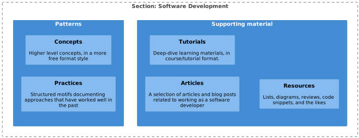

# 4_Software_development

## Patterns for programmers && techies

Plenty of source material exists out there for developers. Admittedly, a lot of those books are more factual than this one will ever be.

During my time coaching less experienced people, I noticed that the sheer volume of good information can be quite overwhelming for
a beginner in the field. So in good old engineering fashion, I am combating the overabundance of good standards by creating yet another one.
My hope is that this section will give you an introduction on what it takes to be good at our job.
If all goes well, it should encourage you to dig deeper into more specialized material, which can be found in the Appendix section.

> [!WARNING]
> **This is not a bingo chart.** Unlike when playing Pokémon, you will not get a special prize for getting all the patterns in this publication into your work or life.
> You are encouraged to be eclectic, and only use the practices that resonate with you. Feel free to change them as you see fit, after all:
> Who are we to tell you what to do?

### Code Samples

This section includes a variety of programming patterns that have been collected, and put to use
in both personal and professional projects. In order to make learning them a bit easier, we have included
code samples to these patterns. They can help you understand the approaches described in the patterns and offer
a great way of getting some practical experience with them. The code included in the patterns can be written in a variety of languages, but
the default language is Oracle Java.

| Technology           | Download link                                                                    |
|----------------------|----------------------------------------------------------------------------------|
| Java Development Kit | [Oracle website](https://www.oracle.com/java/technologies/javase-downloads.html) |
