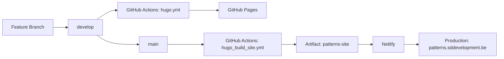

# Workflows: Build, Test, and CI/CD

> Summary of build processes, testing infrastructure, release workflows, and continuous integration for Penguin Pragmatic Patterns.

## Build System Overview

**Primary Build Tool:** Hugo v0.152.2 extended  
**Package Managers:** Go modules (Hugo theme), npm (dev dependencies)  
**Build Output:** Static HTML site (~59MB, 373 pages)

### Build Environments

| Environment | Branch | Trigger | Destination | URL |
|-------------|--------|---------|-------------|-----|
| **Development** | `develop` | Push | GitHub Pages | https://sddevelopment-be.github.io/penguin-pragmatic-patterns/ |
| **Production** | `main` | Push | Netlify (via artifact) | https://patterns.sddevelopment.be |

## Local Development Workflow

### Prerequisites

**Required:**
```bash
# Hugo extended version 0.152.2
wget -O /tmp/hugo.deb https://github.com/gohugoio/hugo/releases/download/v0.152.2/hugo_extended_0.152.2_linux-amd64.deb
sudo dpkg -i /tmp/hugo.deb
hugo version  # Verify: should show "extended"
```

**Optional:**
```bash
# Dart Sass (for advanced SCSS processing)
sudo snap install dart-sass

# Node.js dependencies (for linting)
npm ci  # If package-lock.json exists
```

### Build Commands

#### 1. Clean Production Build

```bash
hugo --gc --minify --buildDrafts=false
```

**Details:**
- Duration: ~900ms-1s
- Output: `public/` directory (~59MB)
- Generates: 352 EN pages, 21 NL pages, 703 static files
- **Note:** Use `--buildDrafts=false` to avoid TOML delimiter errors in draft files

#### 2. Development Build (with drafts)

```bash
hugo --gc --minify --buildDrafts=true
```

**Details:**
- Includes draft content for testing
- **Warning:** Some draft files have incomplete TOML front matter

#### 3. Local Development Server

```bash
hugo server --bind 0.0.0.0
```

**Details:**
- Starts on http://localhost:1313
- Auto-reloads on file changes
- Build time: ~170ms per rebuild
- Watches: archetypes, assets, content, data, layouts, static, config.yaml, go.mod

#### 4. Hugo Module Management

```bash
# Download theme modules (first time, ~12 seconds)
hugo mod graph

# Update modules
hugo mod get -u

# Clean module cache
hugo mod clean
```

### Known Build Issues

#### Issue 1: TOML Delimiter Errors in Draft Files

**Problem:** Some draft practice files have `++ ` or `++` instead of `+++` delimiters

**Affected Files:**
- `communication_channel_compression.md`
- `easy_to_change.md`
- `rotating_meeting_roles.md`
- `the_hat_you_wear.md`

**Error Message:**
```
invalid TOML delimiter
EOF looking for end TOML front matter delimiter
```

**Workaround:**
- Use `--buildDrafts=false` for CI builds
- OR fix delimiters to `+++` in affected files

#### Issue 2: Missing JSON Layout Warning

**Warning:**
```
found no layout file for 'json' for kind 'section'
```

**Status:** Safe to ignore — JSON output is optional

### Build Performance

**Timing:**
- Hugo module download: ~12 seconds (first time only)
- Clean build: 900ms-1s
- Incremental rebuild: 170-200ms
- Hugo server startup: <1s

**Resource Usage:**
- Public directory: ~59MB
- Total pages: 373 (352 EN + 21 NL)
- Static files: ~703 files

## CI/CD Workflows

**Location:** `.github/workflows/`

### Workflow 1: GitHub Pages Deployment

**File:** `hugo.yml`  
**Name:** Deploy Hugo site to Github Pages

**Trigger:**
- Push to `develop` branch
- Manual workflow dispatch

**Permissions:**
```yaml
contents: read
pages: write
id-token: write
```

**Concurrency:** Single deployment at a time, no cancellation

**Steps:**

1. **Install Hugo CLI**
   ```bash
   wget -O ${{ runner.temp }}/hugo.deb \
     https://github.com/gohugoio/hugo/releases/download/v0.152.2/hugo_extended_0.152.2_linux-amd64.deb
   sudo dpkg -i ${{ runner.temp }}/hugo.deb
   ```

2. **Install Dart Sass**
   ```bash
   sudo snap install dart-sass
   ```

3. **Checkout**
   ```yaml
   uses: actions/checkout@v3
   with:
     submodules: recursive
     fetch-depth: 0
   ```

4. **Setup Pages**
   ```yaml
   uses: actions/configure-pages@v3
   ```

5. **Install Node.js dependencies**
   ```bash
   [[ -f package-lock.json || -f npm-shrinkwrap.json ]] && npm ci || true
   ```

6. **Build with Hugo**
   ```bash
   hugo --gc --minify --baseURL "${{ steps.pages.outputs.base_url }}/"
   ```
   **Environment:**
   - `HUGO_ENVIRONMENT=production`
   - `HUGO_ENV=production`

7. **Upload artifact**
   ```yaml
   uses: actions/upload-pages-artifact@v3
   with:
     path: ./public
     name: github-pages
   ```

8. **Deploy to GitHub Pages**
   ```yaml
   uses: actions/deploy-pages@v4
   ```

**Output:** https://sddevelopment-be.github.io/penguin-pragmatic-patterns/

### Workflow 2: Production Build

**File:** `hugo_build_site.yml`  
**Name:** Build package for sddevelopment.be

**Trigger:**
- Push to `main` branch
- Manual workflow dispatch

**Permissions:**
```yaml
contents: read
pages: write
id-token: write
```

**Concurrency:** `prod-deploy` group, no cancellation

**Steps:** (Similar to Workflow 1, differences below)

**Build Command:**
```bash
hugo --gc --minify --baseURL "$PRODUCTION_SITE_URL"
```

**Upload Artifact:**
```yaml
uses: actions/upload-artifact@master
with:
  name: patterns-site
  path: ./public
```

**Note:** No deployment step — artifact consumed externally (Netlify)

**Output:** Build artifact `patterns-site` for https://patterns.sddevelopment.be

### Workflow 3: PR Branch Cleanup

**File:** `cleanup.yml`  
**Name:** Cleanup (inferred)

**Trigger:** PR closed

**Purpose:** Automatically delete merged PR branches

**Details:** (Specific implementation not detailed)

### Workflow 4: README Update

**File:** `update_readme.yml`  
**Name:** README Update (inferred)

**Purpose:** Maintain README.md with changelog content

**Action:** Auto-commit changes

**Details:** (Specific implementation not detailed)

### Workflow 5: Content Validation

**File:** `validation.yml`  
**Name:** Validation (inferred)

**Purpose:** Content validation and quality checks

**Details:** (Specific implementation not detailed)

### CI Environment

**Runner:** `ubuntu-latest`  
**Hugo Version:** 0.152.2 extended  
**Node.js:** Latest (auto-detected from package.json if present)  
**Dart Sass:** Installed via snap

**Environment Variables:**
- `HUGO_VERSION=0.152.2`
- `HUGO_ENVIRONMENT=production`
- `HUGO_ENV=production`
- `PRODUCTION_SITE_URL` (for main branch builds)

## Testing Infrastructure

### Content Validation

**Location:** `/validation/`

**Purpose:** Validate content structure, front matter, and data integrity

**Checks:**
- TOML front matter syntax
- Tag existence in glossary
- UUID uniqueness
- Required sections in practices/concepts
- Image references

**Status:** ⚠️ Validation script details not fully inspected

### Linting

#### JavaScript Linting

**Tool:** ESLint  
**Configuration:** `eslint.config.js`  
**Dependencies:** `package.json`
- `@eslint/js`
- `@eslint/eslintrc`
- `globals`

**Run:**
```bash
npm ci  # Install dependencies
npx eslint .  # Run linter (inferred)
```

#### CSS Linting

**Tool:** Stylelint  
**Configuration:** `.stylelintrc.json`

**Run:**
```bash
npx stylelint "**/*.css"  # (inferred)
```

### Manual Testing

**Content Preview:**
```bash
hugo server --bind 0.0.0.0
# Visit http://localhost:1313
```

**Build Validation:**
```bash
hugo --gc --minify --buildDrafts=false
# Check for errors in build output
```

**Link Checking:** ⚠️ No automated link checker detected

**Image Validation:** ⚠️ No automated image validation detected

## Release Workflow

### Release Strategy

**Branching Model:**
- `develop` — Development/preview branch → GitHub Pages
- `main` — Production branch → Netlify

**Release Process:**
1. Work on feature branches
2. Merge to `develop` for preview
3. Test on GitHub Pages
4. Merge to `main` for production release
5. Automated build and artifact upload
6. External deployment to Netlify

**Versioning:** ⚠️ No explicit versioning detected (continuous deployment)

### Content Publishing

**New Practice/Concept:**
1. Create content in `content/en/practices/` or `content/en/concepts/`
2. Use template from `src/templates/`
3. Generate UUID with `uuidgen`
4. Add glossary entries for new tags
5. Set `draft = false` when ready
6. Commit and push to `develop`
7. Review on GitHub Pages
8. Merge to `main` for production

**Book Entry:**
1. Add entry to `data/bibliography.toml`
2. Run `bash src/scripts/ops/generate_books.sh data/bibliography.toml`
3. Commit generated page in `content/en/books/`
4. Push to `develop`, then `main`

### Deployment Pipeline



## Script Automation

### Book Page Generation

**Script:** `src/scripts/ops/generate_books.sh`

**Purpose:** Generate Markdown book pages from `data/bibliography.toml`

**Usage:**
```bash
bash src/scripts/ops/generate_books.sh data/bibliography.toml
```

**Input:** TOML book entries with UUID, title, authors, etc.  
**Output:** `content/en/books/*.md` (UUID-named files)

### CSS Optimization

**Script:** `src/scripts/ops/cssMinifier.sh`

**Purpose:** Minify and optimize CSS files

**Usage:** (Details not fully inspected)

## Monitoring & Observability

### Build Status

**GitHub Actions:** Visible in repository Actions tab  
**Badge:** ⚠️ No README build badge detected

### Site Availability

**Development:** https://sddevelopment-be.github.io/penguin-pragmatic-patterns/  
**Production:** https://patterns.sddevelopment.be

**Monitoring:** ⚠️ No explicit uptime monitoring detected

### Error Reporting

**Build Errors:** Reported in GitHub Actions logs  
**Content Errors:** Detected during Hugo build (404s, missing images)  
**Runtime Errors:** ⚠️ No client-side error tracking detected

## Build Artifacts

### GitHub Actions Artifacts

**1. github-pages** (from `hugo.yml`)
- Path: `./public`
- Size: ~59MB
- Format: Static HTML/CSS/JS
- Retention: GitHub Actions default (90 days)

**2. patterns-site** (from `hugo_build_site.yml`)
- Path: `./public`
- Size: ~59MB
- Format: Static HTML/CSS/JS
- Retention: GitHub Actions default (90 days)
- Consumer: External Netlify deployment

### Local Build Artifacts

**Generated Directories:**
- `/public/` — Hugo build output (gitignored)
- `/resources/_gen/` — Hugo generated resources (gitignored)

**Lock Files:**
- `.hugo_build.lock` — Hugo build state (gitignored)

## Dependency Management

### Go Modules (Hugo Theme)

**File:** `go.mod`

```go
module patterns

require (
    github.com/StefMa/hugo-fresh v1.0.0
    github.com/jgthms/bulma v0.0.0-20230818164217-fa1d448c1f5b
)
```

**Update:**
```bash
hugo mod get -u
hugo mod tidy
```

### Node.js Dependencies

**File:** `package.json`

```json
{
  "devDependencies": {
    "@eslint/eslintrc": "^3.3.1",
    "@eslint/js": "^9.39.1",
    "globals": "^16.5.0"
  }
}
```

**Update:**
```bash
npm update
npm audit fix
```

**Lock File:** `package-lock.json` (auto-generated, gitignored)

## Workflow Triggers Summary

| Workflow | Trigger | Branch | Manual | Scheduled |
|----------|---------|--------|--------|-----------|
| `hugo.yml` | Push | `develop` | ✅ | ❌ |
| `hugo_build_site.yml` | Push | `main` | ✅ | ❌ |
| `cleanup.yml` | PR closed | N/A | ❌ | ❌ |
| `update_readme.yml` | (Unknown) | (Unknown) | ⚠️ | ⚠️ |
| `validation.yml` | (Unknown) | (Unknown) | ⚠️ | ⚠️ |

## Future Workflow Enhancements

❗️ **Identified Gaps:**

1. **Automated Testing:**
   - No unit tests for scripts
   - No integration tests for content generation
   - No link checking automation

2. **Content Validation:**
   - Validation workflow exists but details unclear
   - Could benefit from:
     - Automated tag validation against glossary
     - UUID uniqueness checks
     - Front matter schema validation
     - Image reference validation

3. **Release Management:**
   - No explicit versioning or changelog automation
   - Could implement semantic-release
   - Could add release notes generation

4. **Monitoring:**
   - No uptime monitoring for production site
   - No performance monitoring
   - No client-side error tracking

5. **Security:**
   - No dependency vulnerability scanning
   - No SAST/DAST security checks

6. **Performance:**
   - No lighthouse CI
   - No bundle size tracking
   - No performance budgets

---

**Last Updated:** 2025-11-12  
**CI Platform:** GitHub Actions  
**Build Tool:** Hugo v0.152.2 extended  
**Deployment:** Dual (GitHub Pages + Netlify)  
**Active Workflows:** 5 (3 detailed, 2 partially documented)
