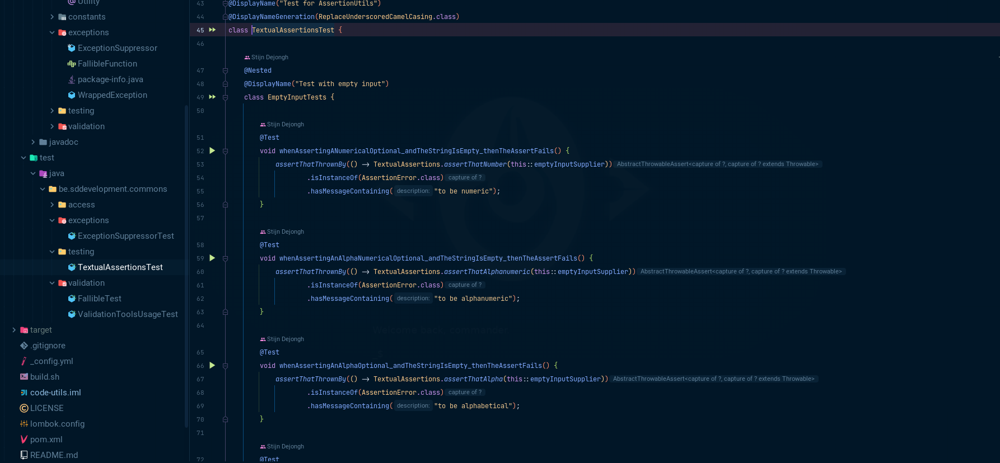

<!-- _coverpage.md -->

# Pragmatic Penguin Patterns <small>2.1.0-BETA</small>
## Be a better software developer

[Start Reading](/0_Intro/HOME)
[GitHub](https://github.com/sddevelopment-be/penguin-pragmatic-patterns)

<!-- background color -->

