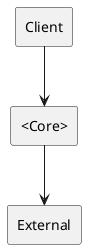

# <Architecture Name> Primer

## 1. Concept Overview
- Core idea and problem domain
- Key identifying features

## 2. Structural Sketch
- Lightweight diagram (PlantUML/Mermaid)
- Main components and communication paths

## 3. Operating Model
- Typical flow of control and ownership

## 4. Strengths and Weaknesses
- Comparative table of trade-offs

## 5. When to Use / Move On
- Suitable contexts and evolution paths

## 6. Ecosystem Compatibility
- Tooling and team setups that fit well

## 7. Common Variations
- Hybrid forms and adaptations

## 8. Field Notes
- Observational notes from practice
