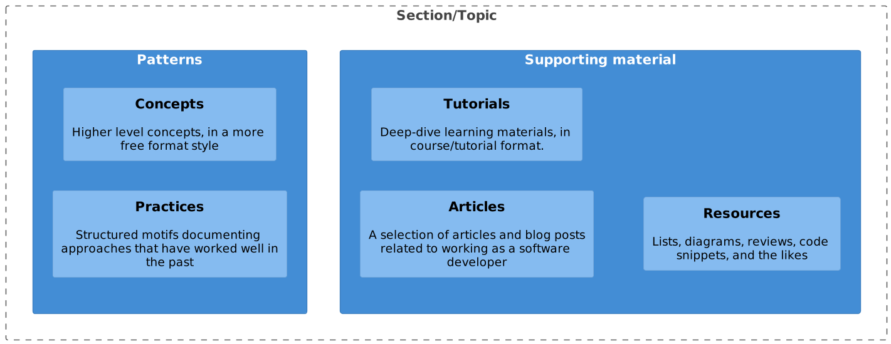

# Preface: "Hello world!"

Are you interested in learning how to be better at the things you do on a daily basis?
Are you working in a technical, or mostly technical role?
Or are you just interested in picking the brains of those who are?

If so, keep reading as this piece of writing could be of value for you.

Over the years, I have consumed a lot of books, articles, and videos with the goal of improving my skills as a technical professional.
Some lessons I have learned during this time have proven to be great assets time and time again. Others have been mostly liabilities to
my work. I have had the pleasure of working with some very capable, and motivated developers. But I did notice that what our industry
lacks most is common ground. Other professions are more mature than ours. Which is only natural, as they have been around for ages. Their
By comparison to crafts such as woodworking, medicine, or even politics, software development is a fairly young profession.

At the time of writing (late 2022), the technology industry has been steadily growing in size and importance year-on-year.
Us nerds are now at the point where we can safely say that we control most of the world. While this does sound like a dream come true
for our 10-year-old selves who fantasized about living in cyber-space and being all-powerful wizards, the reality is more grim.
Right now around 20% of people working as software developers have less than two years of experience[^0]. As our industry
doubles in size every few years, this number is only expected to rise as time passes and technology becomes more important.

This rapid growth is one of our biggest strengths. On the flip side, it is also our biggest challenge as an industry.
We seem to be unable to come up with a good way to express our ideas, and even less able to communicate these ideas and our
experience to the next generation of software professional. The internet is filled with information on how to write code, how to make
things works, and a plethora of "quality of life hacks" that are supposed to make our lives as developer a lot easier.
But when going online, you will also see that if you put two developers in the same room, they will have three opinions on what the
right way to do things is.

Realizing it is somewhat contradictory to state there are too many opinions out there while writing an opinionated text, allow me to
explain why I set about writing this entire thing. The basic premise is: _I don't really care how you end up doing things_. If you find
a way that works well for you, great! By all means, keep doing it. The goal here is to bundle snippets of ideas, practices, stories, and
resources that have been valuable to me personally. I strongly believe that we can only learn better ways of doing things by trying
things out. And in order to try something, we must first realize it is there in the first place.

What you have in front of you is a collection of _"tales from the trenches", aimed at helping you stand on the shoulders of the giants that have come before us.
Learn what worked, but more importantly: learn why it worked. If you come across a piece of advice that sounds like it might be applicable to you,
try it out amd see what results you achieve with it. When it did not work out as expected, figure out why it did not work. If you are feeling particularly charitable,
share you newfound knowledge with your friends, coworkers, or the general public.

> [!QUOTE] _“Heeded my words not, did you? Pass on what you have learned. Strength. Mastery. But weakness, folly, failure also.
> Yes, failure most of all. The greatest teacher, failure is. Luke, we are what they grow beyond. That is the true burden of all masters.”_
>
> -- Yoda, Jedi master

## Intended Audience

This work is a learning and development knowledge base, aimed to share knowledge with other technical professionals.
Most sections of this repository acts as somewhat of a “personal wiki”. It contains knowledge and information that
has been collected from various sources, and is extended with some personal interpretations and
experiences of the author.

## Structure

As we live our lives, we tend to learn a great deal about a wide variety of topics.
From time to time we are stumped by how elegant, or easy, someone solves a certain problem. You are left wondering
why you have not been tackling similar problems in the same way. It could have saved you vast amounts of frustration, if
only you had known earlier.

This catalog aims to bundle little nuggets of enlightenment these aha-moments tend to deliver.
I hope that someone, somewhere learns something that makes their lives a bit more enjoyable.

> [!NOTE]
> As this knowledge base will likely remain a work in progress for some while,
> not all content will be refined. It is advisable to check out the [Changelog](/X_Appendix/HOME?id=changelog) in order
> to see what has changed recently.

You will likely already be familiar with some ideas in this book, in which case: feel free to
move on. If you think I am blabbering and giving bad advice, do leave a comment or suggestion
on the [github page](https://github.com/sddevelopment-be/penguin-pragmatic-patterns).

To make the readers experience more enjoyable, this book is ordered by categories.
Each category contains some of the following content:

- **A collection of Patterns:** Little snippets of information to inspire you. These can be used as general pieces of
  advice that may or may not be applicable to your current situation. To maximize their usefulness, these patterns (or
  motifs) follow a similar structure.
- **Articles and short-form information:** These sections contain a list of articles that were written by either myself
  or others and added with their permission. These articles can be opinionated pieces, additional context, or specific
  case-studies.
- **Resources and Reviews :** As stated earlier, there are a lot of great books on the topics I will discuss in this course.
  Most of them do a much better job of explaining the concepts than I can ever hope to do. So to point you in the right direction, I
  will do my best to include some of the content that I have enjoyed learning from.

A set of concepts and common abbreviations can be found in the [glossary](/X_Appendix/Glossary/HOME).

If you are interested in diving deeper into some subjects mentioned in this work, be sure to take a look at
the [Reading list](/X_Appendix/Learning_Materials/HOME) section included in the appendices. There, you will find an
overview of great books, articles, and audiovisual recourses that are worth checking out.

> [!NOTE]
> The information in this knowledge base is to be seen as a series of techniques that have worked well for people in the past.
> However, they are not _'recipes'_. Meaning that you are encouraged to take the ideas and adapt them to fit your personal context.

# A pattern-based approach

Exchanging knowledge is a challenging activity. The aim is to communicate thoughts and ideas in a way that makes them
resonate with the receiving party. To communicate effectively, groups of people tend to resort to using jargon.
The term `jargon` means: _"The specialized language of a trade, profession, or similar group,
especially when viewed as difficult to understand by outsiders."_.
Its goal is to make the exchange of information more efficient by giving specific names to things that are relevant to
the in-group. It is said that the Inuit have over thirty words to differentiate between different types of snow.
Other professions, such as software developers, strongly rely on metaphors to refer to technical concepts.

When looking for a structured way to represent ideas, experiences, or cookbooks (i.e. knowledge), it helps to first take
a look at how we see _"knowledge"_ itself. Us software developers tend to resort to modeling things when we want to
understand them a bit better. By visualizing our ideas, and how they relate to each other, we create a "map" of how we
perceive a certain set of concepts.

Happy reading, we hope you learn something helpful. If you did, please pass on what you have learned to someone you know that might find
your newly gained knowledge helpful.

> [!WARNING]
> **This is not a bingo chart.** Unlike when collecting Pokémon, you will not get a special prize for getting all the patterns in this publication into your work or life.
> You are encouraged to be eclectic, and only use the practices that resonate with you. Feel free to change them as you see fit, after all:
> Who are we to tell you what to do?

---

[^0] Statistics retrieved from [https://www.zippia.com/software-engineer-jobs/demographics/](https://www.zippia.
com/software-engineer-jobs/demographics/), Evolution of software engineer demographics in the USA in 2019.

[^1] Unfortunately knowing this does not instantly make you a great chess player, as my elo on online platforms so adequately reminds me.

[^2] So wide-spread even, that academics have [started investigating](https://www.michelecoscia.com/?page_id=2070) what makes some memes
successful while others are doomed to be left in the ditches of the web.

