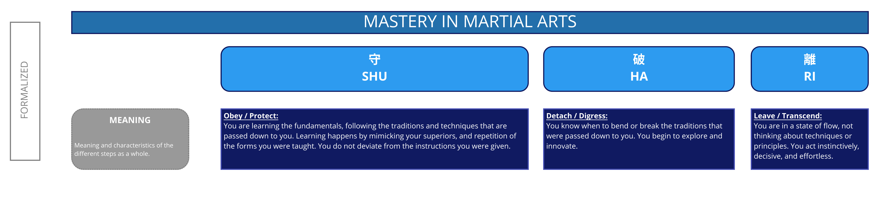

# Shu Ha Ri

Shu Ha Ri is a Japanese martial art concept that is used to describe the stages of learning on the path to mastery.

## Description

> When we learn or train in something, we pass through the stages of shu, ha, and ri. These stages are explained as follows. In shu, we repeat the forms and discipline ourselves so that our bodies absorb the forms that our forebears created. We remain faithful to these forms with no deviation. Next, in the stage of ha, once we have disciplined ourselves to acquire the forms and movements, we make innovations. In this process the forms may be broken and discarded. Finally, in ri, we completely depart from the forms, open the door to creative technique, and arrive in a place where we act in accordance with what our heart/mind desires, unhindered while not overstepping laws.
> ~ sensei Seishiro Endo [2005](https://web.archive.org/web/20110610205348/http://homepage3.nifty.com/aikido_sakudojo/Shihan_Interview_Dou144-e.html)

### Shu 守: Obey / Protect

You are learning the fundamentals, following the traditions and techniques that are passed down to you. Learning happens by mimicking your superiors, and repetition of the forms you were taught. You do not deviate from the instructions you were given

### Ha 破: Detach / Digress

You know when to bend or break the traditions that were passed down to you. You begin to explore and innovate.

### Ri 離: Leave / Transcend

You are in a state of flow, not thinking about techniques or principles. You act instinctively, decisive, and effortless.

## Related Patterns and Resources

| Item | Description | Action |
|---|---|---|
| Some thingy | Why it is here | What to do with it? |
