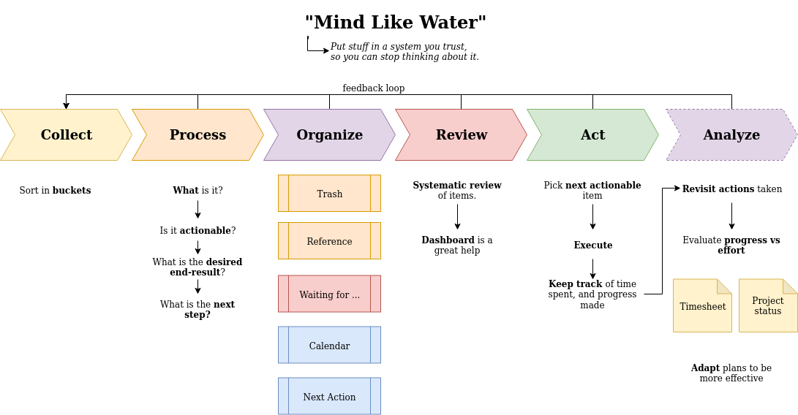

## Organize your workflow

### Context

### Drivers

* You want to finalize your tasks and "get things done"
* People are often distracted by their own thoughts
* Multitasking is hard. Our brains work better if we can compartmentalize between different modes of thinking
* Our memories are very lossy. We tend to forget about things all the time
* Standard To-Do lists have no readily available means of prioritizing items
* Having too many things on our mind stresses us out

### Solution

### Examples

#### Personal productivity flow using MS online tooling 

In recent years, microsoft has pivotted towards providing office-as-a-service applications.
Most if these can be easily incorporated into your personal workflow. Having everything online makes it easier to be productive,
without losing your mobility.

### References

| Item                                                                                                                   | Description                                                        | 
|------------------------------------------------------------------------------------------------------------------------|--------------------------------------------------------------------|
| [Getting thihgs done - David Allen](https://www.amazon.com/Getting-Things-Done-Stress-Free-Productivity/dp/0143126563) | Link to book (amazon)                                              |
| [NextCloud](https://nextcloud.com/)                                                                                    | A self-hosted personal filen organizer, and productivity platform. | 

---

